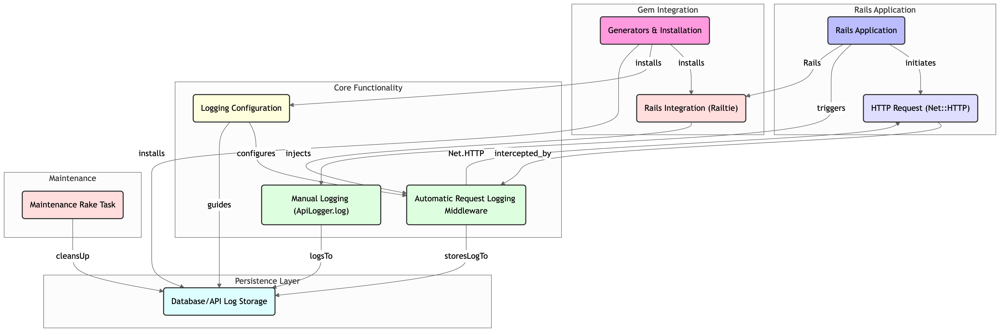

# API Logger

A simple gem for logging API requests and responses in Rails applications. It automatically logs outbound HTTP requests to specified hosts with zero configuration needed.

## Overview


## Features

- **Selective Request Logging**: Logs outbound HTTP requests only to specified hosts
- **Zero Configuration**: Works out of the box with sensible defaults
- **Flexible Control**: Easy to enable/disable logging through configuration
- **Comprehensive Logging**: Captures request parameters, response bodies, status codes, and errors
- **Database Storage**: All logs are stored in your database for easy querying
- **Rails Integration**: Seamlessly integrates with your Rails application
- **Stack Safe**: Prevents recursive logging and stack overflow issues

## Installation

Add this line to your application's Gemfile:

```ruby
gem 'api_logger', github: 'Superlinear-Insights/api_logger'
```

And then execute:

```bash
$ bundle install
$ rails generate api_logger:install
$ rails db:migrate
```

## Configuration

Configure which hosts to log by creating an initializer (`config/initializers/api_logger.rb`):

```ruby
ApiLogger.configure do |config|
  # The database table where logs will be stored
  config.table_name = 'api_logs'  # default

  # Enable/disable all logging functionality
  config.enabled = true  # default

  # Enable/disable automatic request logging via middleware
  config.use_middleware = true  # default

  # Specify which hosts to log (empty array means log nothing)
  config.allowed_hosts = [
    'services.mfcentral.com',
    'uatservices.mfcentral.com'
  ]
end
```

### Configuration Options

- `table_name`: The name of the database table where logs will be stored
- `enabled`: Master switch to enable/disable all logging functionality
- `use_middleware`: Controls automatic logging of HTTP requests
- `allowed_hosts`: Array of host strings that should be logged (empty means log nothing)


## Usage

### Automatic Request Logging

With default configuration, any HTTP request to allowed hosts will be automatically logged:

```ruby
# This request WILL be logged
uri = URI('https://services.mfcentral.com/api/v1/users')
response = Net::HTTP.get_response(uri)

# This request will NOT be logged
uri = URI('https://api.other-service.com/users')
response = Net::HTTP.get_response(uri)
```

### Accessing Logs

Logs are accessible through the `ApiLog` model:

```ruby
# Get the most recent log
ApiLog.last

# Get recent logs
ApiLog.order(created_at: :desc)

# Find logs for a specific endpoint
ApiLog.where(endpoint: '/api/v1/users')

# Get failed requests (status >= 400)
ApiLog.where('response_status >= ?', 400)

# Get successful requests
ApiLog.where('response_status < ?', 400)
```

### Log Data Structure

Each log entry contains:
- `endpoint`: The API endpoint that was called
- `request_params`: Parameters sent with the request (stored as JSON)
- `response_body`: The response received (stored as JSON)
- `response_status`: HTTP status code of the response
- `error_message`: Error message (for failed requests)
- `created_at`: When the log was created
- `updated_at`: When the log was last updated

## Maintenance

To clean up old logs, use the provided rake task:

```bash
# Clean logs older than 30 days (default)
rails api_logger:clean

# Clean logs older than N days
DAYS=7 rails api_logger:clean
```
